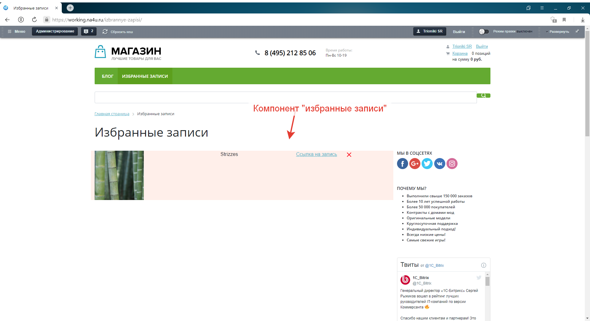

# Component favorites for 1C-Bitrix

Компонент Блог.
Компонент Избранные записи.

Компонент "Блог".
Просто выводит данные из инфоблока, так же содержит кнопку добавить в избранное, выполненную в виде звёздочки.
При нажатии данные: ID пользователя, ID элемента, имя, ссылка на картинку, ссылка на страницу детального просмотра, добавляются в highload-блок. 

Компонент "Избранные записи" (для блога).
Функционал доступен только зарегистрированным пользователям.
Если пользователь не авторизован - показывает текст: "Авторизуйтесь, чтобы использовать функционал отложенных записей" и ссылку на авторизацию.
Если пользователь авторизован - показывает записи, которые он добавил в избранное.
В компоненте используется кэш, компонент на классах и D7.

Установка:  
Поместить папку rioka в каталог local\components  
Обновить компоненты в публичной части сайта

Картинки: 

  
 
 

 

 

 

 

 

 